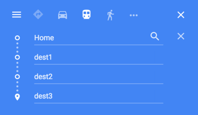

# gmap [![NPM version][npm-image]][npm-url] [![Build Status][travis-image]][travis-url] [![Coverage percentage][coveralls-image]][coveralls-url]

> Google Maps' Unofficial Url Wrapper

<br>

## Installation

```sh
$ npm install --save gmap
```

<br>

## Usage

```js
var gmap = require('gmap');

gmap.directions('my house', 'your house');
//=> 'https://www.google.com/maps?saddr=my%20house&daddr=your%20house'
```


[See it for yourself](https://www.google.com/maps?saddr=my%20house&daddr=your%20house)  

<br>

```js
var query = {
  saddr: 'home', //starting address
  daddr: ['dest1', 'dest2', 'dest3'], //destination addresses
  dirflg: 'r' //public transit
}

gmap(query);
//=> 'https://www.google.com/maps?saddr=home&dirflg=r&daddr=dest1+to:dest2+to:dest3'
```



[See it for yourself](https://www.google.com/maps?saddr=home&dirflg=r&daddr=dest1+to:dest2+to:dest3)

<br>
<br>

## Query Parameters

Google Maps has a cryptic query system - this will make it easier to craft anything you'll need:

<br>

#### saddr=
`string`  

Sets the starting point. You can also add text into this in brackets to bold it in the directions sidebar.

#### daddr=
`string` or `array`  

Sets the end point(s), and again will bold any text added in brackets.You can also add "+to:" which will set via points. These can be added multiple times.

#### q=
`string`  

Specify the search query.
eg :

http://maps.google.com?q=newyork or
http://maps.google.com?q=51.03841,-114.01679

#### near=
`string`  

Specify the location alternative to `q=`. Also has the added effect of allowing you to increase the AddressDetails Accuracy value by being more precise. Mostly only useful if query is a business.

#### z=
`string`

Zoom level. Can be set 19 normally, but in certain cases can go up to 23. More information on the super-high zoom level images can be found [here](https://googleblog.blogspot.com/2005/09/illuminated-continent.html).

#### spn=
`string`

Sets the span width and height that the geocoder will compute. Basically, it limits the number of degrees long/lat that will be shown.

#### sspn=
`string`

Sets the boundaries for the search span.

#### mrt=
`string`

Specifies the type of search (left blank by default, which searches everything). Can be set to:

`all` – all results
`loc` – locations based. Requires q to be filled.
`yp` – the business search. Also requires q to be set, and works better with loc as well.
`kmlkmz` – searches the community maps. Requires a location set either in q, loc or near.
`websearch` – searches webpages that Google has given a geographical position.
`realestate` – gives real estate based results. Obviously.

#### ll=
`string`

Latitude and longitude of the map centre point. Must be in that order. Requires stringified decimal format. Interestingly, you can use this without q, in which case it doesn’t show a marker.

#### sll=
`string`

Similar to ll, only this sets the lat/long of the centre point for a business search. Requires the same input criteria as ll.

#### t=
`string`

Sets the kind of map shown. Can be set to:

`m` – normal  map
`k` – satellite
`h` – hybrid
`p` – terrain

#### layer=
`string`

Turns overlays on and off. Can be set to `t` for traffic or `c` for street view, or `tc` for both at the same time.

#### view=
`string`

Controls the view type. Set to `text` for text, or `map` for map.

#### mrad=
`string`

Allows you to add additional destination addresses. Just as a quick aside, you can use saddr=, daddr= and mrad= instead of "+to:" if you want.

#### dirflg=
`string`

This controls the route that will be planned. Can be set to h for no motorways, r for public transport only or w for walking directions.

#### via=
`string`

Allows you to insert via points in directions. Must be in CSV format. For example, via=1,5 addresses 1 and 5 will be via points without entries in the sidebar. The start point (which is set as 0), and 2, 3 and 4 will all show full addresses.

#### doflg=
`string`

Changes the units used to measure distance (will default to the standard unit in country of origin). Change to `ptk` for metric or `ptm` for imperial.

#### cbll=
`string`

The latitude and longitude values for Street View.

#### cbp=
`string`

Alters the Street View window. Controls (in order) window size, bearing, tilt, zoom and pitch.

#### start=
`string`

Skips the first match for search

#### num=
`string`

Controls how many matches are displayed. Will accept values up to `10`.

#### om=
`string`

Set to `1` to open the overview map, or anything else to close it.

#### ie=
`string`

Sets the input character encoding, e.g., ie=`UTF8`.

#### oe=
`string`

Sets the output character encoding, e.g., ie=`UTF8`.

#### output=
`string`

Sets the output format. Can be set to:

`html` - standard
`js` – gives you object literals and function calls
`kml` – an XML file like the one from the start
`nl` – XML formatted NetworkLink wrapper, which links to a URL for information to be used with Google Earth and Google Maps
`embed` – for embedding maps into other sites (also note that this requires the s= param which is obfuscated)
`dragdir` – outputs a JSON object containing the reverse geocode and an encoded polyline for a given route

#### f=
`string`

Controls the form style. Can be set to `d` for the directions form, `l` for the local version, or `q` for the normal one.

#### latlng=
`string`

Not sure. Inputs as 3 figures in CVS format, but only uses the last one. Seems to have something to do with business locations. Must be used with valid data for other operators. Also, must have `q=`.

#### cid=
`string`

Same as latlng, but allows you to specify map size.

#### geocode=
`string`

Geocoding service for embedded maps.

#### Iwloc=
`string`

Does funky things with the info window. Can be set to:

`A-J` – opens the info window over a business marker
`near` – puts it over the green arrow (when shown)
`addr` – places it over a set address (the default value)
`start`, `end` and `pausex` – for use in driving directions, where x is the number of the point in question

#### iwd=
`string`

Sets the info window to expanded view when set to 1.

#### iwstate1=
`string`

Puts the infowindow into various edit modes. Can be set to:

`sscorrectthiscard` – standard edit mode
`sscorrectthiscard:ssmovemarkercard` – for marker position edits
`sscorrectthiscard:ssedithistorycard` – allows you to view a marker’s history

#### pw=
`string`

Sets print mode.

#### msa=
`string`

Does stuff with My Maps. Set to `0` show defined My Maps, `b` to turn the My Maps sidebar on, `1` to show the My Maps tab on its own, or `2` to go to the new My Map creator form.

#### msid=
`string`

Specifies My Maps identifiers. Use it with `ms` and `msa=0` to show particular My Maps.

#### vp=
`string`

Activates Copyright Service mode. Returns information about the copyright ownership in Javascript format. Only works when the `spn=` and `z=` are set. Can also include `t` for map type and key for setting an API key.

#### hl=
`string`

Controls the language. Can be set to:

`eu` = Basque
`ca` = Catalan
`hr` = Croatian
`cs` = Czech
`da`  = Danish
`nl`  = Dutch
`en`  = English
`fi` = Finnish
`fr`  = French
`de`  = German
`gl`  = Galacian
`el` = Greek
`hi`  = Hindi
`id`  = Indonesian
`it`  = Italian
`ja` = Japanese
`no`  = Norwegian
`nn`  = Nyorsk
`pt`  = Portuguese
`rm` = Raeto-Romance
`ru`  = Russian
`sr`  = Serbian
`sk`  = Slovak
`sl` = Slovenian
`es`  = Spanish
`sv`  = Swedish
`th`  = Thai
`tr` = Turkish
`uk`  = Ukrainian
`vi`  = Vietnamese

[reference](http://moz.com/ugc/everything-you-never-wanted-to-know-about-google-maps-parameters)


## License

MIT © [Dawson Botsford](http://dawsonbotsford.com)


[npm-image]: https://badge.fury.io/js/gmap.svg
[npm-url]: https://npmjs.org/package/gmap
[travis-image]: https://travis-ci.org/dawsonbotsford/gmap.svg?branch=master
[travis-url]: https://travis-ci.org/dawsonbotsford/gmap
[coveralls-image]: https://coveralls.io/repos/dawsonbotsford/gmap/badge.svg
[coveralls-url]: https://coveralls.io/r/dawsonbotsford/gmap
